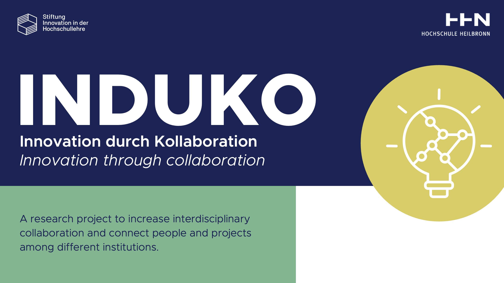

<p align="center">
  <a href="https://www.hs-heilbronn.de/de/induko" target="blank"></a>
</p>

[circleci-image]: https://img.shields.io/circleci/build/github/nestjs/nest/master?token=abc123def456
[circleci-url]: https://circleci.com/gh/nestjs/nest

<p align="center">


Heilbronn University is researching advanced technical tools and didactic approaches designed to foster collaboration and interaction. The primary goal is to enhance and facilitate interdisciplinary, inter-faculty, and inter-university cooperation. Through the InduKo research project, we aim to strengthen this collaboration using innovative digital tools and modern, digitally supported strategies that boost motivation and foster innovation through partnership.

Unisync streamlines communication by automating the creation of messenger chat groups that correspond to course rooms in ILIAS. Designed as a lightweight and adaptable solution, Unisync could be adapted and integrated with other learning management systems (LMS) beyond ILIAS. One fundamental constraint in its development was the lack of direct system access to ILIAS. As a result, a web scraper was used to extract course data and transfer it to the Matrix system. This method allows Unisync to function without requiring any modifications to ILIAS or other LMS platforms, preserving their security and system integrity. Additionally, it ensures that the solution remains highly adaptable to different university environments without increasing maintenance complexity or security risks.

Unisync does not require additional software installation for the users - teachers can generate chat groups simply by accessing a link stored in ILIAS or bookmarked in their browser. After logging into the LMS, course data is transferred to the Matrix system, where chat groups are automatically created, participants are assigned, and invitations are sent. These groups can then be accessed through Matrix-based messengers such as Element or FluffyChat. The system’s flexibility, security, and low maintenance requirements make it an efficient and scalable solution for universities looking to enhance digital collaboration. Further information can be found in the PDF document linked above. Unisync showcases how a lightweight solution can create Matrix-based course rooms from LMS data without deep system integration.

Unisync was developed as part of a subproject within the <a href="https://www.hs-heilbronn.de/en/projekt-induko-2cab68e84c21b797" target="_blank">InduKo project (Innovation through Collaboration) </a> , which was funded by <a href="https://stiftung-hochschullehre.de/en/" target="_blank">Stiftung Innovation in der Hochschullehre </a> (August 2021 - July 2024).

</p>

# unifyhn_matrix - Matrix Server for HNUnisync
[](https://app.fossa.com/projects/git%2Bgithub.com%2FHHN%2FUNIFY_UNISYNC_SERVER?ref=badge_shield)


**unifyhn_matrix** is the Matrix server backend for **HNUnisync.de**, enabling seamless communication between students and instructors through Matrix rooms created from ILIAS course enrollments. It automates the creation and management of Matrix rooms, providing a scalable communication platform for educational institutions.

## Key Features

- **Matrix Protocol Integration**: Synchronizes ILIAS courses with Matrix rooms to facilitate real-time communication between students and instructors.
- **Automated Room Creation**: Automatically creates Matrix rooms based on course enrollments and invites students to the appropriate rooms.
- **Secure User Authentication**: Users log in using Matrix credentials, ensuring that access to communication channels is restricted to authorized participants.
- **Supports Multiple Matrix-Based Messaging Clients**: Users can join rooms using any Matrix client, such as **Element** or **FluffyChat**, for a seamless communication experience.

## Technologies Used

- **Matrix-Nio**: Python library for interacting with the Matrix protocol.
- **Quart**: For building asynchronous web services.
- **Matrix-Synapse**: The primary server software for running the Matrix communication server.
- **Requests**: For making HTTP requests during server interactions.
- **Python**: Core programming language used for development.

## Prerequisites

- **Python 3.8+**
- **Matrix-Synapse**: Ensure that the Matrix-Synapse server is installed and configured. Refer to the [Matrix Synapse documentation](https://matrix-org.github.io/synapse/latest/setup/installation.html) for setup instructions.

## Installation & Setup

1. **Setup the initaial project, installing and running Matrix Server by running a setup.sh file**:
   ```bash
   cd unifyhn_matrix
   chmod +x setup.sh
   ./setup.sh
   ```

2. **Matrix server configuration**:
   Configure the following environment variables to connect with the Matrix Synapse server:
   - Update homeserver.yaml file as the configuration written in the homeserver_unifyhn.yaml file
   


3. **Re Start the Matrix Server**:
   ```bash
   synctl restart
   synctl start
   synctl stop
   ```
4. **Verify the Server Status**:
   Ensure that your Matrix Synapse server is running properly and that the integration service can communicate with it.

## Usage

- **Automatic Room Creation**: Once the integration service is running, it listens for requests from the **HNUnisync** application to create and manage Matrix rooms.
- **User Invitations**: Students enrolled in ILIAS courses are automatically invited to the respective Matrix rooms.
- **Join Matrix Rooms**: Students and instructors can use their preferred Matrix-based messaging applications (e.g., **Element**, **FluffyChat**) to join the rooms and engage in discussions.

## Contributing

Contributions are welcome! To contribute to the project, please follow these steps:

1. **Fork the repository**.
2. **Create a new branch** for your feature or bugfix (`git checkout -b feature-name`).
3. **Make your changes** and **commit them** (`git commit -m 'Add a new feature'`).
4. **Push the branch** to your fork (`git push origin feature-name`).
5. **Submit a pull request** to the `main` branch of the original repository.

## Contact

For support or inquiries, please open an issue on the GitHub repository or reach out to the repository owner.

## Links

- Matrix Server URL: [https://unifyhn.de](https://unifyhn.de)

## License
- This project is licensed under [Apache 2.0](LICENSE). Copyright 2024 , Hochschule Heilbronn.


[](https://app.fossa.com/projects/git%2Bgithub.com%2FHHN%2FUNIFY_UNISYNC_SERVER?ref=badge_large)

## Acknowledgments

This project was developed as part of the **InduKo Project**, funded by **Stiftung Innovation in der Hochschullehre**. We also acknowledge the support from students, faculty, and contributors who have been part of this collaborative effort.

For more information about the InduKo research project, visit the official website.